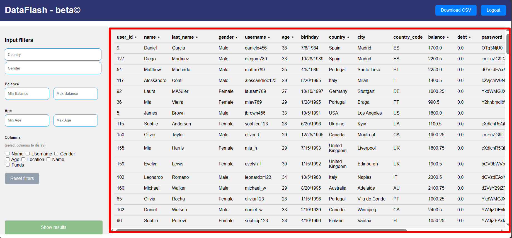
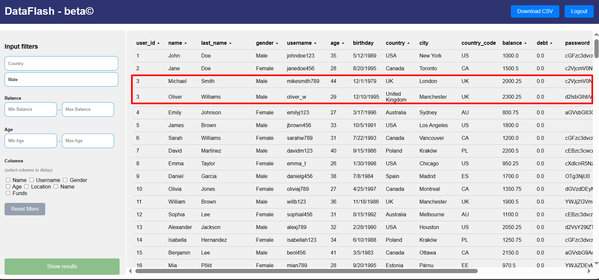

| __Project Name__        | DataFlash Test Report                                                                                                                                                                                                        |
| ----------------------- | ---------------------------------------------------------------------------------------------------------------------------------------------------------------------------------------------------------------------------- |
| __Name of Product__     | DataFlash https://dataflash.netlify.app/index.html                                                                                                                                                                           |
| __Product Description__ | Web Application to present user information in a table                                                                                                                                                                       |
| __Project Description__ | **Mission of project**: Conducting comprehensive testing to verify the quality of application and creating a test report **Projects Output**: Application test report and summary to evaluate the web application quality |
# Test Report

|  BugID   | Priority |  <nobr>Topic  |                                                      <nobr>Description‎ ‎                                                       |             <nobr>Pre-requisities              |                                                                                                                   Test <nobr>Steps                                                                                                                    |                                                                               <nobr>Expected result                                                                               |                                                                             <nobr>Actual <nobr>result                                                                              |                                                                                                           <nobr>Screenshot                                                                                                           |                                                                        <nobr>Environment                                                                        |
| :------: | :------: | :-----------: | :-----------------------------------------------------------------------------------------------------------------------------: | :--------------------------------------------: | :---------------------------------------------------------------------------------------------------------------------------------------------------------------------------------------------------------------------------------------------------: | :-------------------------------------------------------------------------------------------------------------------------------------------------------------------------------: | :--------------------------------------------------------------------------------------------------------------------------------------------------------------------------------: | :----------------------------------------------------------------------------------------------------------------------------------------------------------------------------------------------------------------------------------: | :-------------------------------------------------------------------------------------------------------------------------------------------------------------: |
| DataF_01 |  Medium  | Functionality |                            Balance filter needs both Min and Max balance to display correct entries                             | URL must be working and user must be logged in |                           1. Open URL https://dataflash.netlify.app/index.html  2. Login with given password 3. Give argument to Balance filter Max Balance (or vice versa) 4. Click on the button 'show results'                            | User should see correct  entries even when only of the argument is given (max or min balance) so the default value of Min balance is 0 and Max balance is infinity |                                              It displays all the entries when only one of the argument is given (Max or Min balance)                                               |                                                                                                                                                                                         |                 Browser: Microsoft Edge for Business Version 123.0.2420.65 (Official build) (64-bit)  OS: Windows 10 Education Version 22H2                  |
| DataF_02 |  Medium  | Functionality |          Drop-down menu of Country filter needs user to choose a value. Can't close it afterwards if value not chosen.          | URL must be working and user must be logged in |                                                       1. Open URL https://dataflash.netlify.app/index.html  2. Login with given password 3. Open Country filter and then try to close it                                                        |                                                     User should be able to close the drop-down menu when accidentally opened                                                      |                                                     Drop-down menu remains open even after user tries to click on blank space                                                      |                                                                                                                                                                                         |                 Browser: Microsoft Edge for Business Version 123.0.2420.65 (Official build) (64-bit)  OS: Windows 10 Education Version 22H2                  |
| DataF_03 |  Medium  | Functionality |                                           Age filter doesn't display correct entries                                            | URL must be working and user must be logged in |                  1. Open URL https://dataflash.netlify.app/index.html  2. Login with given password 3. Choose country if necessary 4. Give argument to Age filter (Min Age or Max) 4. Click on the button 'show results'                  |                                           User should see correct  entries even when Min Age or/and Max Age argument is given                                            |                                                           It displays wrong entries that don't fall between given range                                                            |                                                                                                                                                                                         |                 Browser: Microsoft Edge for Business Version 123.0.2420.65 (Official build) (64-bit)  OS: Windows 10 Education Version 22H2                  |
| DataF_04 |  Medium  | Functionality | When displaying only chosen columns, reordering is not working on some special occasions or the reordering logic is not correct | URL must be working and user must be logged in |         1. Open URL https://dataflash.netlify.app/index.html  2. Login with given password 3. Choose country if necessary 4. Try to play with different "select columns to display" options 5. Click on the button 'show results'         |                               User should should be able to order entries by clicking on column header to see logical ascending/descending order                               |                                       User is not able to order entries by clicking on header or the ordering of the entries is not logical                                        |                                                                                                                                            |                 Browser: Microsoft Edge for Business Version 123.0.2420.65 (Official build) (64-bit)  OS: Windows 10 Education Version 22H2                  |
| DataF_05 |  Medium  | Functionality |       Gender filter options are switched (Male is Female  and vice-versa). Female filter options also shows both gender.        | URL must be working and user must be logged in |                                     1. Open URL https://dataflash.netlify.app/index.html  2. Login with given password 3. Try to choose gender from gender filter 4. Click on the button 'show results'                                      |                                      User should see male gender entries when choosing 'male' from drop-down menu. Same with female entries.                                      |                  When choosing male gender in filters, female entries are shown. When choosing male female gender in filters, female and male entries are shown.                   |                                                                                                                                            |                 Browser: Microsoft Edge for Business Version 123.0.2420.65 (Official build) (64-bit)  OS: Windows 10 Education Version 22H2                  |
| DataF_06 |  Medium  | Functionality |          Drop-down menu of Gender filter needs user to choose a value. Can't close it afterwards if value not chosen.           | URL must be working and user must be logged in |                                                        1. Open URL https://dataflash.netlify.app/index.html  2. Login with given password 3. Open Gender filter and then try to close it                                                        |                                                     User should be able to close the drop-down menu when accidentally opened                                                      |                                                     Drop-down menu remains open even after user tries to click on blank space                                                      |                                                                                                                                                                                         |                 Browser: Microsoft Edge for Business Version 123.0.2420.65 (Official build) (64-bit)  OS: Windows 10 Education Version 22H2                  |
| DataF_07 |  Medium  |     UI/UX     |                                    Just some typos and wrong words that occur in application                                    | URL must be working and user must be logged in |                                                          1. Open URL https://dataflash.netlify.app/index.html  2. Login with given password 3. Locations of typos shown in screenshots                                                          |                                                              User experience should be free of typographical errors                                                               |                                                             Some typographical error occur during the user experience                                                              |  |                 Browser: Microsoft Edge for Business Version 123.0.2420.65 (Official build) (64-bit)  OS: Windows 10 Education Version 22H2                  |
| DataF_08 |  Medium  |     UI/UX     |                                                 Some filters don't have headers                                                 | URL must be working and user must be logged in |                                                     1. Open URL https://dataflash.netlify.app/index.html  2. Login with given password 3. Locations of missing headers shown in screenshots                                                     |                                                                Filters should have headers to be better understood                                                                |                                                             Some filters don't have headers during the user experience                                                             |                                                                                                                                                                                        |                 Browser: Microsoft Edge for Business Version 123.0.2420.65 (Official build) (64-bit)  OS: Windows 10 Education Version 22H2                  |
| DataF_09 |   High   | Functionality |                                         Country code and city don't match with country                                          | URL must be working and user must be logged in |                                     1. Open URL https://dataflash.netlify.app/index.html  2. Login with given password 3. Open Country filter and choose a country 4. Click on the button 'show results'                                     |                                                                  Country code and city should match with country                                                                  |                                                               Some country codes and cities don't match with country                                                               |                                                                                                                                                                                        |                 Browser: Microsoft Edge for Business Version 123.0.2420.65 (Official build) (64-bit)  OS: Windows 10 Education Version 22H2                  |
| DataF_10 |  Medium  | Functionality |                            Choosing country from filter doesn't show entries with correct countries                             | URL must be working and user must be logged in |                                      1. Open URL https://dataflash.netlify.app/index.html  2. Login with given password 3. Open Country filter and choose country 4. Click on the button 'show results'                                      |                                                                  Entries should match given Country filter value                                                                  |                                                              Some entries don't match with given Country filter value                                                              |                                                                                                                                                                                        |                 Browser: Microsoft Edge for Business Version 123.0.2420.65 (Official build) (64-bit)  OS: Windows 10 Education Version 22H2                  |
| DataF_11 |  Medium  |     UI/UX     |                             In 'select columns to display', two options have exactly the same name                              | URL must be working and user must be logged in |                                                  1. Open URL https://dataflash.netlify.app/index.html  2. Login with given password 3. Location of exactly the same names shown in screenshot                                                   |                                                                     Given options should have different names                                                                     |                                                      Some options have exactly the same name (First name/Last name and email)                                                      |                                                                                                                                                                                        |                 Browser: Microsoft Edge for Business Version 123.0.2420.65 (Official build) (64-bit)  OS: Windows 10 Education Version 22H2                  |
| DataF_12 |  Medium  | Functionality |                                            Gives uncaught TypeError when user logins                                            | URL must be working and user must be logged in |                                                                  1. Open URL https://dataflash.netlify.app/index.html  2. Login with given password 3. Error shown in console                                                                   |                                                          Web Application shouldn't give errors in console during the use                                                          |                                                                           Web Application gives an error                                                                           |                                                                                                                                                                                        |                 Browser: Microsoft Edge for Business Version 123.0.2420.65 (Official build) (64-bit)  OS: Windows 10 Education Version 22H2                  |
| DataF_13 |  Medium  | Functionality |                          Clicking on the button 'show results' always gives different order of entries                          | URL must be working and user must be logged in |                                                     1. Open URL https://dataflash.netlify.app/index.html  2. Login with given password 3. Click on the button 'show results' multiple times                                                     |                                                     The entries order should stay the same when nothing is changed in filters                                                     |                                       The order of entries is always randomized when nothing is changed (does it always make a new request?)                                       |                                                                                                                                          |                 Browser: Microsoft Edge for Business Version 123.0.2420.65 (Official build) (64-bit)  OS: Windows 10 Education Version 22H2                  |
| DataF_14 |  Medium  | Functionality |                                     Entry name or/and last name can contain unknown symbols                                     | URL must be working and user must be logged in |                                                            1. Open URL https://dataflash.netlify.app/index.html  2. Login with given password 3. Click on the button 'show results'                                                             |                                                    The entry name should be easy to understand and not contain unknown symbols                                                    |                                                        The entry name and/or last name sometimes contains unknown symbol(s)                                                        |                                                                                                                                                                                        |                 Browser: Microsoft Edge for Business Version 123.0.2420.65 (Official build) (64-bit)  OS: Windows 10 Education Version 22H2                  |
| DataF_15 |   High   |   Security    |                                         Entries passwords are encoded in base64 format                                          | URL must be working and user must be logged in |                                                            1. Open URL https://dataflash.netlify.app/index.html  2. Login with given password 3. Click on the button 'show results'                                                             |                                                      Passwords for entries should be hashed (not reversible like encryption)                                                      | Passwords for entries should not be easily decoded (base64 format encryption based on application database)Passwords for entries should be hashed (not reversible like encryption) |                                                                                                                                                                                        |                 Browser: Microsoft Edge for Business Version 123.0.2420.65 (Official build) (64-bit)  OS: Windows 10 Education Version 22H2                  |
| DataF_16 |  Medium  | Functionality |                                                    Entry age can be too high                                                    | URL must be working and user must be logged in |           1. Open URL https://dataflash.netlify.app/index.html  2. Login with given password 3.  Choose 'female' from gender filter 4. Click on the button 'show results' 5. Click on the header 'age' to filter entries by age           |                                                                           Entry age should be realistic                                                                           |                                                                       Entry age can be unrealistic/too high                                                                        |                                                                                                                                                                                        |                 Browser: Microsoft Edge for Business Version 123.0.2420.65 (Official build) (64-bit)  OS: Windows 10 Education Version 22H2                  |
| DataF_17 |  Medium  | Functionality |                                       Entries can't be sorted when no filters are applied                                       | URL must be working and user must be logged in | 1. Open URL https://dataflash.netlify.app/index.html  2. Login with given password 3. Click on the button 'show results' 4. Try to click on one of the column header: 'last_name', 'gender', 'username', 'age', 'country', 'balance', 'debt' |                                                           User should be able to order entries without filters applied                                                            |                  User can't order the entries without filters applied (except by the column headers 'user_id' and 'name'). Shows 'Uncaught TypeError' in console                   |                                                                                                                                                                                        |                 Browser: Microsoft Edge for Business Version 123.0.2420.65 (Official build) (64-bit)  OS: Windows 10 Education Version 22H2                  |
| DataF_18 |   High   | Functionality |                                                 Entry usernames are not unique                                                  | URL must be working and user must be logged in |       1. Open URL https://dataflash.netlify.app/index.html  2. Login with given password 3. Choose 'female' from gender filter 4. Click on the button 'show results' 5. Sort entries by username to find the faulty entries easier        |                                                                   Entry usernames should be unique (for login)                                                                    |                                                    Entry usernames in some cases are not unique (can create problems in login)                                                     |                                                                                                                                                                                        |                 Browser: Microsoft Edge for Business Version 123.0.2420.65 (Official build) (64-bit)  OS: Windows 10 Education Version 22H2                  |
| DataF_19 |  Medium  | Functionality |                                                     Entries are not unique                                                      | URL must be working and user must be logged in |          1. Open URL https://dataflash.netlify.app/index.html  2. Login with given password 3. Choose 'female' from gender filter 4. Click on the button 'show results' 5. Sort entries by id to find the faulty entries easier           |                                                                             Entries should be unique                                                                              |                                                                            Some entries are not unique                                                                             |                                                                                                                                          |                 Browser: Microsoft Edge for Business Version 123.0.2420.65 (Official build) (64-bit)  OS: Windows 10 Education Version 22H2                  |
| DataF_20 |  Medium  | Functionality |                                                   Entries id-s are not unique                                                   | URL must be working and user must be logged in |          1. Open URL https://dataflash.netlify.app/index.html  2. Login with given password 3. Choose 'female' from gender filter 4. Click on the button 'show results' 5. Sort entries by id to find the faulty entries easier           |                                                                           Entries id-s should be unique                                                                           |                                                       Some entry id-s are not unique (even when other values are different)                                                        |                                                                                                                                                                                        |                 Browser: Microsoft Edge for Business Version 123.0.2420.65 (Official build) (64-bit)  OS: Windows 10 Education Version 22H2                  |
| DataF_21 |  Medium  | Functionality |                                                        Entries are empty                                                        | URL must be working and user must be logged in |          1. Open URL https://dataflash.netlify.app/index.html  2. Login with given password 3. Click on the button 'Download CSV' 4. Open the file database_table.xlsx 5. Sort entries by name to find the empty entries easily           |                                                                            Entries shouldn't be empty                                                                             |                                                                               Some entries are empty                                                                               |                                                                                                                                                                                        | Browser: Microsoft Edge for Business Version 123.0.2420.65 (Official build) (64-bit)  Database app: Microsoft Excel OS: Windows 10 Education Version 22H2 |
| DataF_22 |   High   |   Security    |                                                  Entry password value is empty                                                  | URL must be working and user must be logged in |                                        1. Open URL https://dataflash.netlify.app/index.html  2. Login with given password 3. Choose 'female' from gender filter 4. Click on the button 'show results'                                        |                                                             Entry password should have a value (for security reasons)                                                             |                                                                      Some entry passwords don't have a value                                                                       |                                                                                            |                 Browser: Microsoft Edge for Business Version 123.0.2420.65 (Official build) (64-bit)  OS: Windows 10 Education Version 22H2                  |
| DataF_23 |   High   |   Security    |                                                   Entry email value is empty                                                    | URL must be working and user must be logged in |                                        1. Open URL https://dataflash.netlify.app/index.html  2. Login with given password 3. Choose 'female' from gender filter 4. Click on the button 'show results'                                        |                                                                          Entry email should have a value                                                                          |                                                             Some entry emails don't have a value (not even NULL value)                                                             |                                                                                                                                          |                 Browser: Microsoft Edge for Business Version 123.0.2420.65 (Official build) (64-bit)  OS: Windows 10 Education Version 22H2                  |
| DataF_24 |  Medium  | Functionality |                                      Amount of entries varies when no filters are applied                                       | URL must be working and user must be logged in |                                                            1. Open URL https://dataflash.netlify.app/index.html  2. Login with given password 3. Click on the button 'show results'                                                             |                                                              User should see all entries when no filters are applied                                                              |                                            The amount of entries varies on each 'show results' button click when no filters are applied                                            |                                                                                                                                          |                 Browser: Microsoft Edge for Business Version 123.0.2420.65 (Official build) (64-bit)  OS: Windows 10 Education Version 22H2                  |
| DataF_25 |  Medium  | Functionality |                              Balance and age filter can take any string and show incorrect entries                              | URL must be working and user must be logged in |                                  1. Open URL https://dataflash.netlify.app/index.html  2. Login with given password 3. Type anything into Balance and/or Age filters 4. Click on the button 'show results'                                   |                                              User should see correct entries when false input is given to Age and/or Balance filters                                              |                                                              Entries don't match with filters, that have false input                                                               |                                                                                                                                                                                        |                 Browser: Microsoft Edge for Business Version 123.0.2420.65 (Official build) (64-bit)  OS: Windows 10 Education Version 22H2                  |

# Summary

DataFlash is an intuitive web application to get information about user entries. The application user can get all the information needed if an XLSX database file is downloaded. Although users can receive needed entries, filtering them in a web application is a hassle. Some fundamental issues are in the user database. The issues and probable fixes are brought out as a list.

__Application__:  
- Filters are not working properly. Unclosable drop-down menus make using the application a hassle. Drop-down menus should require users to make a choice. If no choice is made, the user should be able to close the menu by clicking on the empty space, for example. Some filter choices don't reflect in the database results (the age and gender filters, for example).   
- Wrong results if filters are not applied. The application should give all the entries when filters are not applied, just like in the table file, which can be downloaded.  
- Default values should be added to filters that can take two inputs. It's useful when the user wants to enter only one input.  
- Adding a button to untick all 'select columns to display' checkboxes.  
- fixing JS errors that are brought out in the test report.

__Database__:  
- Database uses the 'age' attribute. Because age changes dynamically, it's not really useful to add it as an entry attribute.  
- using 1-way hashing for entry passwords. Base64 encoding is easily reversible and therefore unsecure.  
- Finding the reason the database contains empty entries.  
- Preventing identical entries/usernames/user_ids in the database.  
- Fixing relations between country codes, cities, and countries.  
- Changing the email attribute so the value is required in there.  
- Fixing character encoding in the first and last name columns.

  
